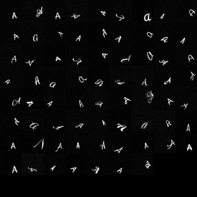

This repository contains implementation of CrossGrad (https://openreview.net/forum?id=r1Dx7fbCW) and DAN (https://arxiv.org/abs/1505.07818).

# Disclaimer
The following software is shared for educational purpose only.

# Dataset
We generated and used a character dataset using several hand-written fonts downloaded from Google Fonts. This dataset is referred to as GFonts dataset and is described in the CrossGrad paper further.

We make available this dataset through this repository. It can be found in the `data/gfonts` folder as numpy binaries. 
- `all_images.npy` is a numpy array containing all the images in the dataset
- `all_labels.npy` numpy array of class labels in teh same order as `all_images.npy`
- `all_domains.npy` numpy array contains the domain labels again in the same order as `all_images.npy`

Following is a sprite of this dataset for character: 'A'

